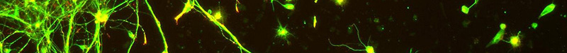

# Woodstock

_Neuron from [flickr](https://flic.kr/p/5giagf) shared under [cc by-nc](https://creativecommons.org/licenses/by-nc/2.0/)_

`Woodstock` a suite of tools used to show and analyse mathematical models of biological processes modeled from (petri nets), this could easily be extended to other fields.

## Building

    # you need go from http://golang.org
    go get github.com/criusmq/woodstock

    go build github.com/criusmq/woodstock

## Contributing

1. Check if there is an existing [issue](https://github.com/criusmq/woodstock/issues) about the same subject.
2. [Create one](https://github.com/criusmq/woodstock/issues/new) if not.
3. Share your patch (as a [pull request](https://github.com/criusmq/woodstock/pulls) preferably).

## Contributors
See [contributors page](https://github.com/criusmq/woodstock/graphs/contributors) for full list of contributors.

## License

Not yet tought about it, so for now: [wtfpl](http://www.wtfpl.net/).

            DO WHAT THE FUCK YOU WANT TO PUBLIC LICENSE 
                        Version 2, December 2014 

     Copyright (C) 2014 Pierre-Alexandre St-Jean <pa@stjean.me> 

     Everyone is permitted to copy and distribute verbatim or modified 
     copies of this license document, and changing it is allowed as long 
     as the name is changed. 

                DO WHAT THE FUCK YOU WANT TO PUBLIC LICENSE 
       TERMS AND CONDITIONS FOR COPYING, DISTRIBUTION AND MODIFICATION 

      0. You just DO WHAT THE FUCK YOU WANT TO.

