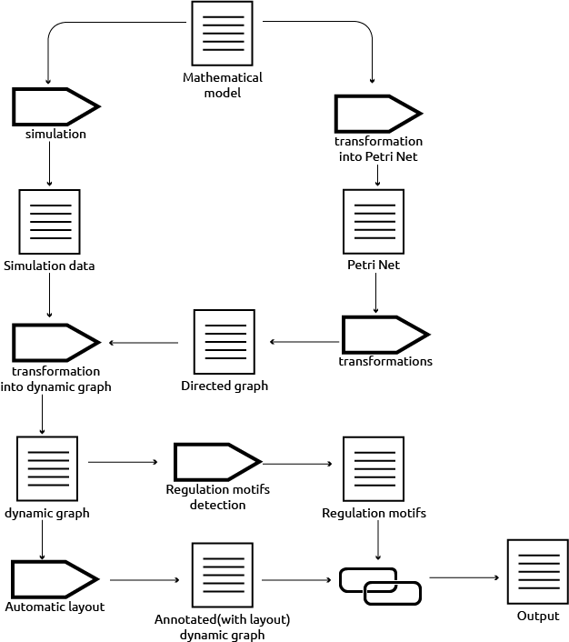

# Woodstock

[Woodstock©](https://en.wikipedia.org/wiki/Woodstock_(Peanuts)) is Snoopy's best friend in [Charles M. Schulz ](https://en.wikipedia.org/wiki/Charles_M._Schulz) comic strip [Peanuts](https://en.wikipedia.org/wiki/Peanuts)
`Woodstock` or whatever the name's gonna be is a web application created to 
represent, analyse mathematical model of biological process.

### Process

## Contributing

### Documentation format
Documentation (like this file) is written in markdown. For more information of
the markdown language format look into thoses links:

- [Daring Fireball Markdown (original author)](http://daringfireball.net/projects/markdown/)
- [Markdown Basics](https://help.github.com/articles/markdown-basics)
- [GitHub Flavored Markdown](https://help.github.com/articles/github-flavored-markdown)

## Transformation into a desktop app

If needs be, a web app can be easily transformed into a desktop app using:

- [Node webkit](https://github.com/rogerwang/node-webkit)
- [Chromium embedded framework](https://code.google.com/p/chromiumembedded/)

example:

- [Brackets IDE](https://github.com/adobe/brackets)
- [Atom.app](https://atom.io/)

Other contenders:

- [XUL Runner](https://developer.mozilla.org/en-US/docs/Getting_started_with_XULRunner)
- [Chrome Apps](http://developer.chrome.com/apps/about_apps)
- 

## Copyrights
